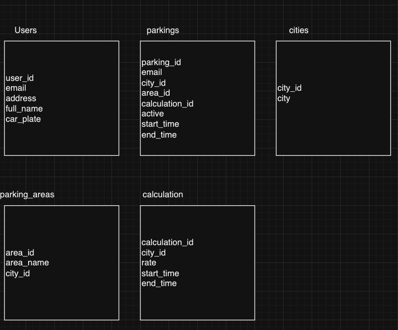

# WHA

This project is a simple parking management API built with Node.js and SQLite. It lets users register with their email, address, full name, and car plate, and log in using just their email and car plate. Users can start and stop parking sessions in different cities and areas, and view their parking history. The database structure includes tables for users, parkings, cities, parking areas, and calculation rules to handle custom parking rates by city and time. Queries are done based on user email to retrieve active or past parking sessions.

DB Selection:

After mapping the entities an sql db became an obvious choice.
There are appearent relations between the different entities and future migration could be done very easly

